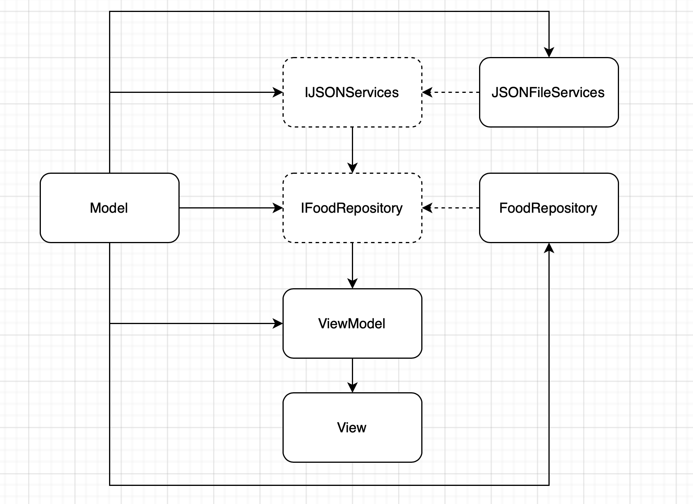
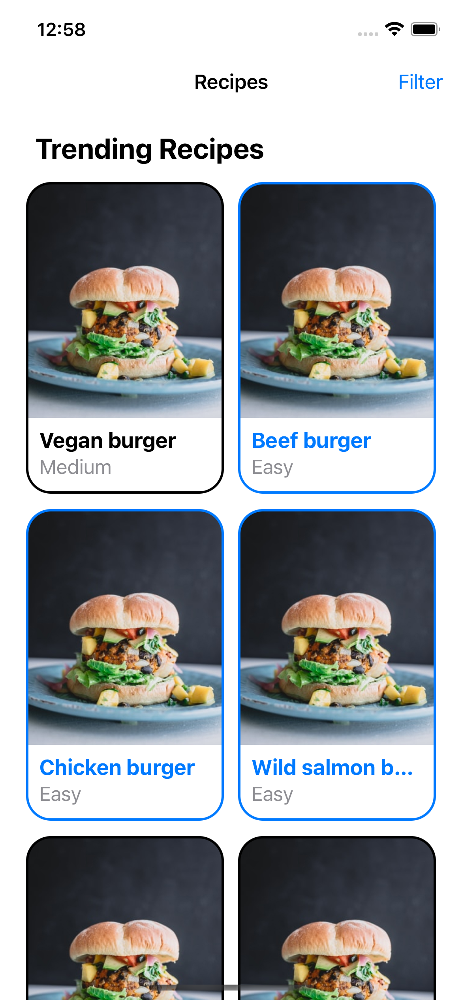
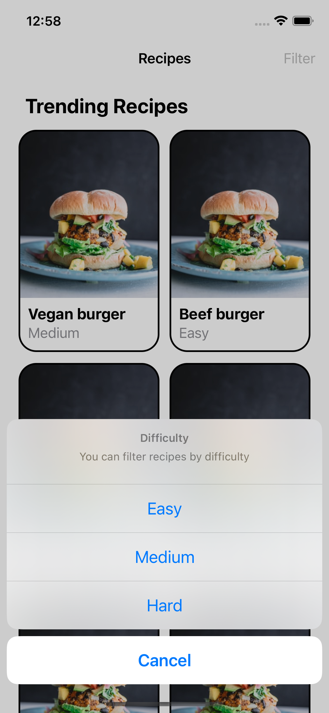
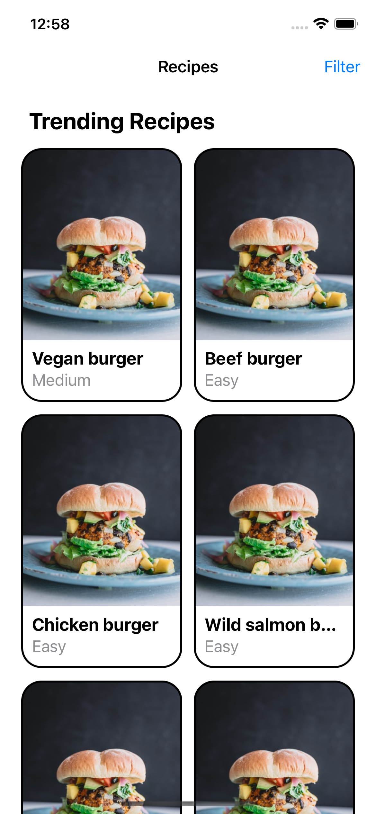

### RecimeAssignment

## Done Tasks
- Create json file(data.json) to save list of food
- Show list of food from json file(data.json)
- Sort foods by positon field
- Show action sheet to filter foods
- Filter list by level (Easy, Medium, Hard)
- Clear filter foods by click on "Cancel" in the action sheet
- Create some unit test for Repository and View Model

## Architecture
- 3 parts: Services, Repository, App

**Services:** Contains Network Services and JSON File Reading Services

**Repositories:** Contains functions to work with Codable data get from Services layer

**App:** Use MVVM design pattern to work with the data from Repository and display it on View

### Architecture Diagram

## Screenshots

